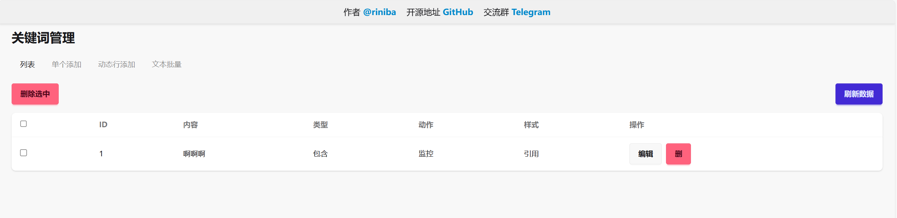
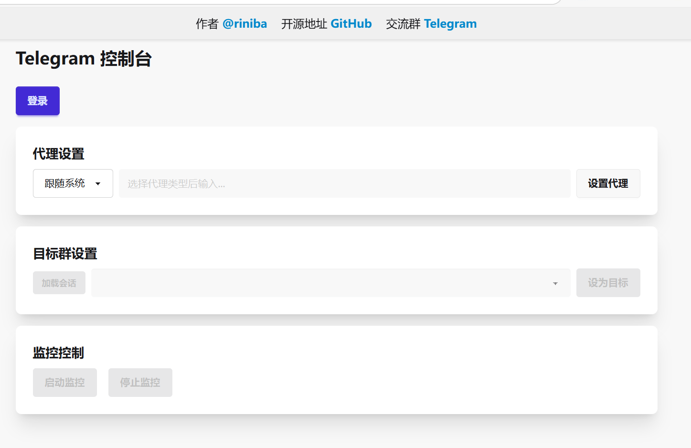
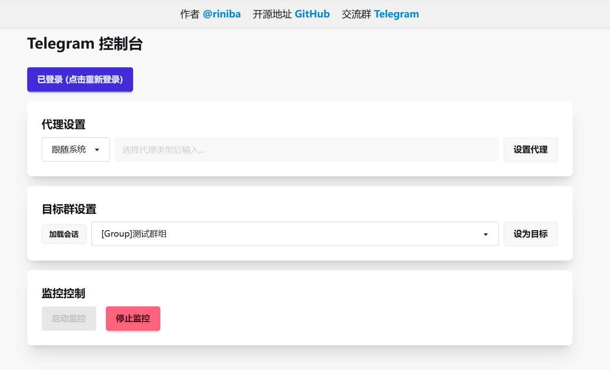
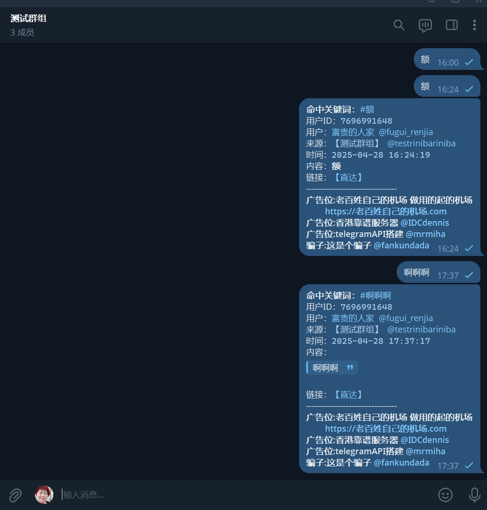

### AD -- 机场推广

**机场 - 老百姓自己的机场**：[https://老百姓自己的机场.com](https://老百姓自己的机场.com)  
咱老百姓就得用自己的机场 **老百姓自己的机场** 做用的起的机场

# Telegram关键词监控 使用说明

## 系统与环境要求
- 最新发布版下载：https://github.com/Riniba/TelegramMonitor/releases/latest
- 发布包提供常见的系统版本已经包含运行时。  
- 如需其他可自行编译
- 请注意 使用时需具备**全局代理**或能**直连 Telegram**。  
- 如果使用的`v2rayN`或者`Clash`等代理软件，**请开启Tun**
- 默认端口是5005，如需修改端口可在`appsettings.json`文件中修改`"Urls": "http://*:5005",` // 默认端口

## Web管理界面
- 关键词管理界面：http://localhost:5005/keywords.html
- Telegram管理界面：http://localhost:5005/telegram.html
- 可以通过Web界面配置账号、监控状态以及代理设置

### 效果图展示

#### 关键词管理界面

#### Telegram 配置界面

#### Telegram 监控状态

#### Telegram 运行效果

## 账号与频道准备
- 准备一个 Telegram 账号，该账号需拥有一个或多个可发布消息的频道或者群组。
- 该账号需对所选频道或者群组拥有发布消息的权限。
- 该账号需加入多个群组（Group），软件将监听这些群组中的消息。
- 当群组中出现匹配关键字的消息时，软件会将该消息内容转发至指定频道。

> **重要提示：**  
> 只会监控群组的消息。请保持软件运行，以持续监听。

## 推荐部署环境
- **强烈推荐使用 Linux 服务器进行长期挂机**：
  - 更稳定的网络连接和系统运行环境
  - 更低的资源占用
  - 支持通过 Screen 或 Systemd 等工具实现后台持久化运行
  - 推荐使用 Ubuntu 20.04+ 或 Debian 11+ 系统
- **服务器要求**：
  - 最低配置：1核1G内存
  - 推荐配置：2核2G内存
  - 网络要求：能够正常访问 Telegram API

## 其他说明
- 本软件免费无毒，可在虚拟机中运行进行长期挂机。
- 有问题请联系 Telegram：[https://t.me/Riniba](https://t.me/Riniba)
- Telegram交流群组 [https://t.me/RinibaGroup](https://t.me/RinibaGroup)

  

---

